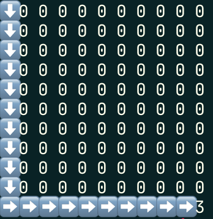

## Description
This app provides a couple of endpoints to create and solve mazes.
For path finding I picked the [A* algorithm](https://en.wikipedia.org/wiki/A*_search_algorithm).

I met all the restrictions from the assignment:
- [x] use the frameworks of your choice — NestJS
- [x] persisting two data collections or tables (users, labyrinths)
- [x] REST API should use BasicAuth
- [x] user creation must work 'on-the-fly', no user deletion needed
- [x] please provide a brief documentation with steps for setting up and
describing the choice of technologies (e.g. DB or framework)

## Technologies used

As a framework I picked NestJS, it provides everything you need: project structure, validation,
swagger annotations. I also like the system of guards/interceptors/validation pipelines.

For persistent storage, I picked MongoDB, because it's easier to run. For this task
it doesn't matter what to choose. Even KV storage would be ok.

Docker & docker-compose for local development.

## Running the app locally
### Running locally using `docker-compose`
#### Pre requirements
```
  nodejs@^14
  yarn@^1.22
  docker
  docker-compose
```

In a root folder, there is a `docker-compose.yml` and `Dockerfile` for development purposes.
Just run `yarn start` and it will run the app inside docker, will install node_modules, and bootstrapped the MongoDB.
```bash
$ yarn start
```

### Running locally without docker
#### Pre requirements
```
  nodejs@^14
  yarn@^1.22
  mongodb@4 installed and runned locally
```

**Before you go, make sure to run mongodb locally on default port.** 
```bash
$ yarn
$ yarn start:dev
```

## How to use

After the successful launch the app will listen for requests at `4000` port.
Also `Swagger` available at [http://localhost:4000/api](http://localhost:4000/api), the list of endpoints you can find there.


### Solve your first maze

The minimum requirement for the maze is to add 2 points: `start` point and `end` point.
All empty cells will populate automatically.

For example:

1) Create a new maze:
```bash
curl -X POST --location "http://localhost:4000/labyrinth" \
    -H "Content-Type: application/json" \
    --basic --user user1:password1
```

It will return new maze with ID
```json
{
  "user": "60ca5e11201f330027fc78f7",
  "tiles": [],
  "matrix": [
    [
      0
    ]
  ],
  "id": "60ca6042bb8b97006de2ad73"
}
```

2) Add starting point
```bash
curl -X PUT --location "http://localhost:4000/labyrinth/60ca6042bb8b97006de2ad73/start/0/0" \
    -H "Content-Type: application/json" \
    --basic --user user1:password1
```
It will return new updated maze:
```json
{
  "user": "60ca5e11201f330027fc78f7",
  "tiles": [
    {
      "x": 0,
      "y": 0,
      "type": "start",
      "id": "60ca60b6bb8b97006de2ad74"
    }
  ],
  "matrix": [
    [
      2
    ]
  ],
  "id": "60ca6042bb8b97006de2ad73"
}

```

3) Set end point at coordinate **10 10**
```bash
curl -X PUT --location "http://localhost:4000/labyrinth/60ca6042bb8b97006de2ad73/end/10/10" \
    -H "Content-Type: application/json" \
    --basic --user user1:password1
```

You will notice, that maze already filled with empty cells.

Cell codes in matrix:
- 0 empty cell
- 1 wall
- 2 start point
- 3 end point


```json
{
  "user": "60ca5e11201f330027fc78f7",
  "tiles": [
    {
      "x": 0,
      "y": 0,
      "type": "start",
      "id": "60ca60b6bb8b97006de2ad74"
    },
    {
      "x": 10,
      "y": 10,
      "type": "end",
      "id": "60ca6122bb8b97006de2ad77"
    }
  ],
  "matrix": [
    [ 2,0,0,0,0,0,0,0,0,0,0 ],
    [ 0,0,0,0,0,0,0,0,0,0,0 ],
    [ 0,0,0,0,0,0,0,0,0,0,0 ],
    [ 0,0,0,0,0,0,0,0,0,0,0 ],
    [ 0,0,0,0,0,0,0,0,0,0,0 ],
    [ 0,0,0,0,0,0,0,0,0,0,0 ],
    [ 0,0,0,0,0,0,0,0,0,0,0 ],
    [ 0,0,0,0,0,0,0,0,0,0,0 ],
    [ 0,0,0,0,0,0,0,0,0,0,0 ],
    [ 0,0,0,0,0,0,0,0,0,0,0 ],
    [ 0,0,0,0,0,0,0,0,0,0,3 ]
  ],
  "id": "60ca6042bb8b97006de2ad73"
}

```

4) Try to solve that

```bash
curl -X GET --location "http://localhost:4000/labyrinth/60ca6042bb8b97006de2ad73/solution" \
    -H "Content-Type: application/json" \
    --basic --user user1:password1
```
It will return path from start to end and the matrix:

```json
{
  "path": [
    "down",
    "down",
    "down",
    "down",
    "down",
    "down",
    "down",
    "down",
    "down",
    "down",
    "right",
    "right",
    "right",
    "right",
    "right",
    "right",
    "right",
    "right",
    "right",
    "right"
  ],
  "matrix": [
    [ ⬇️, 0, 0, 0, 0, 0, 0, 0, 0, 0, 0 ],
    [ ⬇️, 0, 0, 0, 0, 0, 0, 0, 0, 0, 0 ],
    [ ⬇️, 0, 0, 0, 0, 0, 0, 0, 0, 0, 0 ],
    [ ⬇️, 0, 0, 0, 0, 0, 0, 0, 0, 0, 0 ],
    [ ⬇️, 0, 0, 0, 0, 0, 0, 0, 0, 0, 0 ],
    [ ⬇️, 0, 0, 0, 0, 0, 0, 0, 0, 0, 0 ],
    [ ⬇️, 0, 0, 0, 0, 0, 0, 0, 0, 0, 0 ],
    [ ⬇️, 0, 0, 0, 0, 0, 0, 0, 0, 0, 0 ],
    [ ⬇️, 0, 0, 0, 0, 0, 0, 0, 0, 0, 0 ],
    [ ⬇️, 0, 0, 0, 0, 0, 0, 0, 0, 0, 0 ],
    [ ➡️, ➡️, ➡️, ➡️, ➡️, ➡️, ➡️, ➡️, ➡️, ➡️, 3 ]
  ]
}

```

It looks like this



More complex maze:


You can also run the `probe` script, that creates/fills/checks a few kinds of mazes.

```bash
# make sure app is available at localhost:4000
$ yarn probe
```
